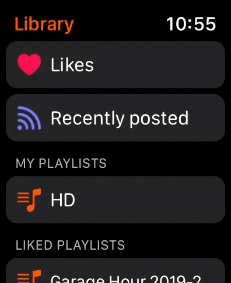

# WatchCloud ⌚️☁️

watchOS client for SoundCloud

## Screenshots (v1.0.0)

    
    
    
    

## Dependencies
📦 [SoundCloud](https://github.com/superturboryan/SoundCloud-api)  
📦 [Nuke](https://github.com/kean/Nuke)  
📦 [KeychainSwift](https://github.com/evgenyneu/keychain-swift/)
